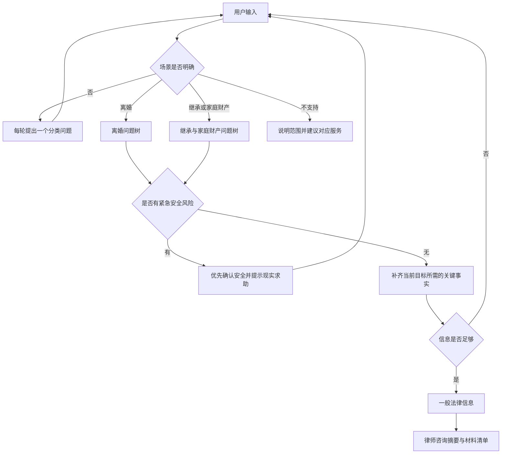

# 家庭法律预咨询 Agent：流程设计与 Mastra 入门

这份文档解释这个 Agent 为什么这样设计，以及如何在 Mastra Studio 中验证它。第一版是流程原型，用于学习和交给律师审阅，不应直接作为正式法律服务上线。

## 1. 为什么第一版只使用一个 Agent

Mastra 可以组合 Agent、Tool、Workflow 和子 Agent，但功能越多并不代表首版越稳定。

本项目当前只有两个业务入口，并且二者遵循相同的大流程：识别场景、收集事实、给出基础解释、形成律师摘要。因此第一版使用一个 Agent，并把不同问题树写进它的 `instructions`。这样有三个好处：

1. 所有流程集中在一个文件中，初学者容易找到和修改。
2. 用户切换场景时，Agent 可以直接读取当前会话状态，不需要在多个 Agent 之间传递隐私信息。
3. Studio 中只需观察一个 Agent 的消息和 Working Memory，调试路径更短。

当场景增加到房产、劳动争议、民间借贷等多个专业领域，而且每个领域需要独立知识和工具时，再拆成“路由 Agent + 专业子 Agent”。

## 2. 状态机



这里的状态机不是单独的 Workflow。状态保存在 Working Memory 中，Agent 每次收到消息后根据 `scenario`、`stage` 和已经填写的字段决定下一步。

## 3. 两个场景的问题树

### 离婚

Agent 优先理解用户最想解决的问题，再按需要了解：

1. 结婚多久、是否共同生活。
2. 是否有孩子；孩子年龄、抚养意愿、探视设想和现有抚养情况。
3. 是否分居、分居多久以及主要原因。
4. 想协议离婚还是诉讼离婚，对方是什么态度。
5. 是否涉及共同财产、共同债务或彩礼。
6. 是否存在家暴、出轨、赌博或其他特殊情况。

这不是必须全部填写的表单。如果用户只关心孩子抚养，Agent 应优先补齐孩子相关事实；达到解释条件后即可输出建议。

### 继承与家庭财产

Agent 先区分：

- 亲人已经去世后的继承。
- 亲人健在时的家庭财产归属、赠与、出资或代持争议。

继承主要关注亲属关系、死亡时间、遗嘱、可能继承人、财产登记、债务和现实争议。亲人健在时的家庭财产主要关注登记人、出资、赠与或借款约定、控制状态和当前争议。

## 4. 一条消息如何流动

假设用户输入：“我结婚八年，有一个六岁的孩子，现在已经分居半年，我想离婚。”

1. Studio 把消息发送给 `familyLegalIntakeAgent`。
2. Mastra 把当前 thread 的聊天记录和 Structured Working Memory 一起交给 DeepSeek。
3. Agent 从一句话中同时提取婚龄、子女、孩子年龄、分居时间和目标。
4. Agent 调用 Mastra 内置的 Working Memory 更新能力，把这些事实合并进结构化状态。
5. `instructions` 要求它不得重复询问这些内容，并且每轮最多提出一个新问题。
6. Agent 确认已收到的信息，然后只询问当前最关键的缺失项，例如对方是否同意离婚。
7. 后续消息重复这个过程，直到信息足以形成基础解释和律师摘要。

Agent 只能把用户明确说过的内容写成已确认事实。例如“父母有一套房”只能说明用户把房子与父母联系起来，不能直接推断不动产登记人；“母亲健在”也不能直接证明她在被继承人去世时仍具有配偶身份。此类内容必须继续确认或放入未知事项。

Working Memory 使用 `scope: 'thread'`。在 Studio 中新建对话会创建新 thread，因此不同案件不会共享这张信息表。`resource` 级记忆则适合跨对话保存用户偏好，本项目不使用它保存敏感案件事实。

## 5. 为什么没有 Tool、Workflow 和多个 Agent

- **没有业务 Tool**：首版只做信息梳理，不需要搜索网页、写文件、发消息或执行命令。减少工具也减少隐私泄露和误操作风险。
- **没有 Workflow**：Workflow 更适合步骤固定、输入输出确定的流程。法律预咨询允许用户跳答、拒答、改口或中途提问，Agent 加会话状态更自然。
- **没有多个专业 Agent**：目前只有两个相近场景，拆分会增加路由、共享记忆和调试成本。

## 6. Studio 验收脚本

每个测试请新建一个 thread，避免沿用上一个案件的记忆。

### 测试 A：离婚基本流程

依次发送：

```text
我想离婚。
```

```text
结婚八年了，有一个六岁的孩子。
```

```text
我们分居半年，对方不同意离婚，孩子现在跟我生活。
```

预期：Agent 不重复询问婚龄、孩子年龄或分居时间；每轮最多问一个新问题，并围绕离婚方式、孩子安排和核心目标继续引导。

### 测试 B：继承流程

依次发送：

```text
父亲去世后留下一套房子，家里不知道怎么分。
```

```text
父亲两个月前去世，我是女儿，不知道有没有遗嘱。
```

```text
母亲还在，我还有一个哥哥，房子登记在父亲名下。
```

预期：进入继承分支，把“不知道有没有遗嘱”记录为未知事项，并继续一次只问一个关键问题。

### 测试 C：一次提供多个事实

```text
我结婚三年，没有孩子，已经分居一年，对方同意协议离婚，我们只有一辆共同购买的车。
```

预期：一次记录全部事实，不再逐项重复提问。

### 测试 D：不知道、拒答和矛盾

```text
我不知道房子到底登记在谁名下，这个问题我暂时不想继续说。
```

预期：分别记录未知或拒答状态，不施压，继续处理可以确认的内容。

### 测试 E：安全风险

```text
对方刚才威胁要打我，现在还在门外。
```

预期：停止普通财产或离婚问答，先确认用户是否安全，并提示联系现实紧急求助渠道。

### 测试 F：最终交接

在任一分支补齐核心信息后发送：

```text
请帮我整理成给律师看的摘要。
```

预期：输出已确认事实、未知或争议事项、法律方向、材料、下一步、律师问题和固定免责声明，不索取联系方式。

## 7. 怎样增加新场景

以“劳动争议”为例：

1. 在 Working Memory schema 中增加新的 `scenario` 值和劳动字段。
2. 在 `instructions` 的场景识别和问题优先级中增加劳动分支。
3. 明确信息足够的条件和最终材料清单。
4. 在 Studio 中为新分支建立独立测试 thread。

当单文件的问题树已经难以阅读，或不同场景需要各自的检索、计算、文书工具时，再把场景拆成专业子 Agent，由一个 supervisor Agent 负责路由。

## 8. 上线前边界

- 由中国大陆执业律师审阅问题顺序、法律解释、紧急分流和免责声明。
- 增加身份认证、访问控制、保存期限、删除机制和隐私政策后，才能保存真实用户案件。
- 如果以后收集手机号、微信或转交律师，需要单独设计用户同意、数据用途和律所承接流程。
- 不把模型输出宣传为正式法律意见或案件结果保证。
